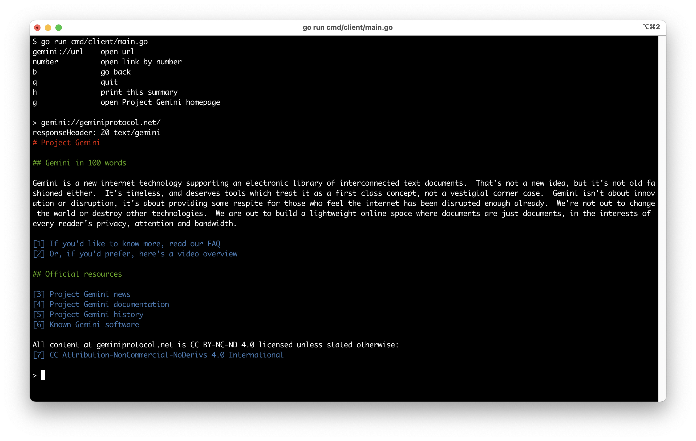

# gemini-tools
personal tools for project gemini protocol

## cmd/client
Simple gemini client.  
`go run cmd/client/main.go`

## cmd/localclient
Simple local database reader for pages crawled by the crawler. UI mirrors cmd/client (colors, hotkeys q/h/g/b, numbered links). If a requested page is not present locally, it prints an error and appends the canonical URL to the queue file.

Run:
`go run cmd/localclient/main.go --db=data --queue=queue.txt`

Use `go test ./...` to validate current implementation.

## Crawler Plan
A detailed plan for a simple Gemini crawler is available in docs/crawler_plan.md. This plan covers storage layout, timestamps, queue management, throttling, error logging, link extraction, and a proposed Go package API for later implementation.

